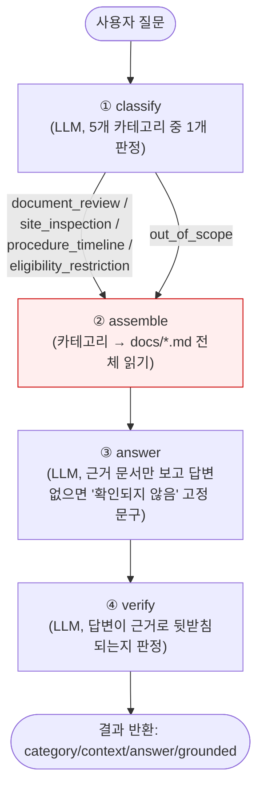
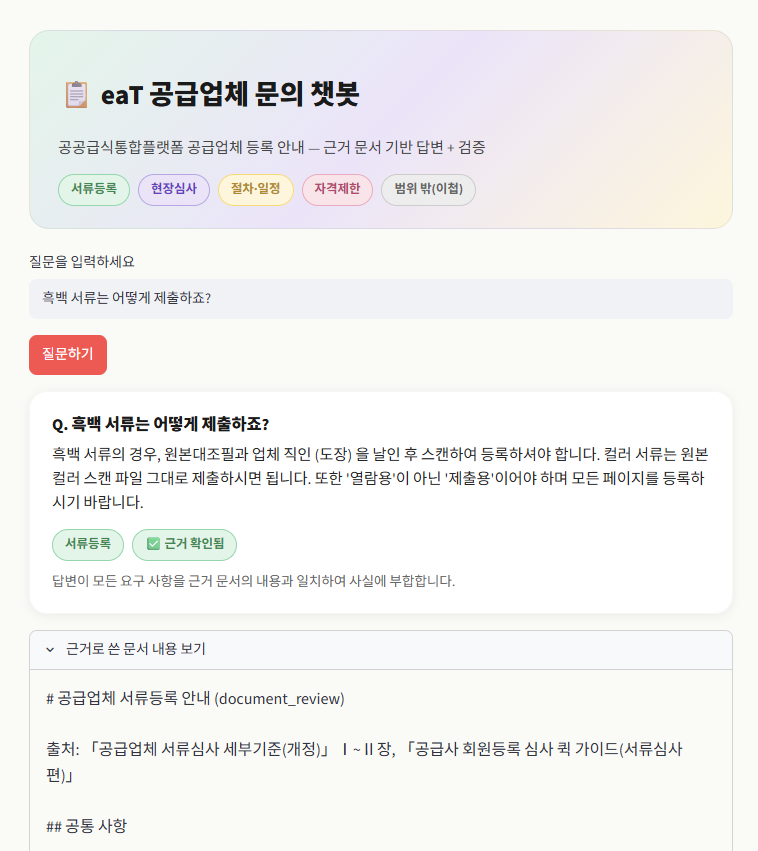

# REPORT — 공공급식통합플랫폼 공급업체 문의 응대 에이전트

## 1. 주제와 근거 문서

**주제**: 공공급식통합플랫폼(eaT) 공급업체 회원등록 관련 문의(서류등록/현장심사/절차·일정/자격제한)에
근거 문서 기반으로 답하고, 문서에 없는 내용은 지어내지 않고 이첩하는 라우팅 에이전트.

이 주제를 고른 이유: 실제 aT(한국농수산식품유통공사)가 운영하는 공공급식통합플랫폼의 공급업체
등록 실무와 직결되는 주제이고, 실제 공개 안내자료(사업자 대상으로 배포되는 자료)를 그대로
근거 문서로 쓸 수 있어 합성 데이터 없이 진짜 문서로 과제를 완성할 수 있었다.

**근거 문서** (모두 `docs/`에 포함, eaT가 공급업체 대상으로 배포하는 공개 안내자료):
- 「공급업체 서류심사 세부기준(개정)」
- 「공급사 회원등록 심사 퀵 가이드 — 서류심사편」
- 「공급사 회원등록 심사 퀵 가이드 — 현장심사편」

## 2. 카테고리 설계

| 카테고리 | 근거 문서 매핑 | 왜 이렇게 나눴는가 |
|---|---|---|
| `document_review` (서류등록) | docs/document_review.md | 등록서류 11~15종의 종류·입력항목·유의사항 — 실제 문의 분포에서 가장 큰 비중 |
| `site_inspection` (현장심사) | docs/site_inspection.md | 서류심사와 완전히 다른 성격(물리적 시설·위생 점검) — 별도 문서로도 이미 분리되어 있음 |
| `procedure_timeline` (절차·일정) | docs/procedure_timeline.md | "얼마나 걸리나요" 류 질문은 서류/현장 어느 쪽에도 속하지 않는 독립적 질문 유형 |
| `eligibility_restriction` (자격제한·제재) | docs/eligibility_restriction.md | 처리 방식이 다름(문서 확인이 아니라 제재·처벌·자격 여부 판단) |
| `out_of_scope` (범위 밖) | 없음(이첩) | 위 네 카테고리 문서로 답할 수 없는 질문 전부 |

## 3. 평가셋 설계

`data/goldenset.json`에 32문항: few-shot 프롬프트 예시용 2문항(`prompt_examples`, 채점 제외) +
채점용 30문항(`eval_set`, 카테고리별 6문항씩 균등 배분).

- 기대 카테고리, 필수사실(`must_include`), 금지사항(`must_not_include`)을 문항마다 명시.
- 문서에 답이 없는 함정 문항(`trap: true`)을 각 답변 가능 카테고리에 최소 1개씩 배치
  (수수료, 방문 시각, 벌금 액수 등 — 문서에 없는데 그럴듯하게 지어낼 수 있는 항목).
- `out_of_scope` 6문항 중에는 완전 무관 질문(날씨/주식/코드/메뉴)뿐 아니라, 문서가 명시적으로
  답하지 않는 정책 해석 질문("다른 플랫폼에도 적용되나요")과 개인별 실제 조회가 필요한 질문
  ("제 서류 통과됐나요")도 포함해 이첩 판단 자체의 난이도를 다양화했다.

## 4. 측정 결과

### 베이스라인 (`experiments/baseline.json`, `experiments/baseline.log`)

- 도구호출 적절성: 23/30 (77%)
- 답변 적절성: 22/30 (73%)

**틀린 건 원인 분류**:
- 진짜 분류 오류 (6건: #3, #4, #5, #6, #10, #11) — document_review/site_inspection 주제인데
  out_of_scope나 인접 카테고리로 잘못 분류되어 엉뚱한 근거 문서를 가져왔고, 그 결과 답변에서
  필수사실이 빠짐. 특히 "파일 몇 MB까지?"(#3), "수수료 얼마?"(#4)처럼 **문서에 정확한 답이
  없거나 세부적인 질문일수록 out_of_scope로 잘못 넘어가는 패턴**이 뚜렷했다.
- 카테고리는 틀렸지만 답은 맞은 경우 (#24) — "현장심사 수진자 제한" 사실이 site_inspection과
  eligibility_restriction 두 문서에 중복 기재되어 있어 우연히 정답을 맞춤.
- 판정기(judge)가 지나치게 엄격한 경우 (#25, #28) — 카테고리·핵심 대응 모두 맞았는데, 골든셋에
  적어둔 문구("문서와 무관하다는 인정" 등)를 글자 그대로 담지 않았다고 감점.

### 가설과 변경 — 분류 프롬프트 1곳만 수정

**가설**: 실패 사례 대부분이 "문서에 구체적인 답이 없어 보이는 질문을 아예 out_of_scope로 잘못
분류"하는 패턴이었다. `prompts.py`의 `CLASSIFY_SYSTEM_PROMPT`가 "확신이 없거나 문서로 답할 수
없으면 out_of_scope로 분류하라"고 되어 있어, **분류(주제 판단)와 답변 가능 여부(문서에 사실이
있는지)를 한 문장 안에서 혼동**시키고 있었다. 이 한 문장만 "분류 기준은 오직 주제이고, 답을
못 찾는 것은 다음 단계(답변 생성)의 문제"로 명확히 분리하면 개선될 것이라 예상했다. 검색 설정,
문서 매핑, 골든셋 등 다른 변수는 전혀 건드리지 않았다.

### 개선 후 (`experiments/improved_classify_prompt.json`, `.log`)

| 지표 | 베이스라인 | 개선 후 |
|---|---|---|
| 도구호출 적절성 | 23/30 (77%) | **26/30 (87%)** |
| 답변 적절성 | 22/30 (73%) | **23/30 (77%)** |

가설대로 도구호출 적절성이 크게 올랐다(#3, #4, #11이 정확한 카테고리로 재분류됨). 반면 답변
적절성은 소폭만 개선됐는데, 남은 오답 대부분이 이제는 분류 오류가 아니라 "정답은 근거로 삼았지만
필수사실 중 일부(예: HACCP 대리점 계약서 조항, 개인사업자 신규가입 필요성)를 답변에서 빠뜨렸다"는
**답변 완성도** 문제로 옮겨갔다(#2, #5, #7). 즉 이번 변경은 분류 단계의 문제를 답변 생성 단계의
문제로 옮겨 놓은 것이지, 답변 생성 자체를 개선한 것은 아니다.

### LLM 백엔드 전환: 로컬 Ollama(qwen3.5:9b) → OpenAI GPT-4o

여기까지는 홈서버(Tailscale)의 로컬 Ollama `qwen3.5:9b`로 실험했다. 이후 "이 근거 문서는 전부 공개
자료라 보안 문제가 없고, 과제라 굳이 로컬을 고집할 필요가 없다"는 판단에 따라 OpenAI `gpt-4o`
API로 백엔드를 바꿨다(`.env`의 `OPENAI_API_KEY` 사용, `python-dotenv`로 로드). temperature는
0으로 고정했다 — 안 그러면 프롬프트를 바꾼 효과인지 단순 실행별 무작위성인지 구분할 수 없기 때문
(실제로 이 프로젝트 초반에 이 문제로 한 번 헷갈렸다).

**전환 직후 발견한 버그 (도구호출 83% / 답변 50%로 답변 점수가 급락)**: `answer()` 노드가 규칙·근거
문서·질문을 전부 하나의 `user` role 메시지에 욱여넣고 있었는데, `qwen3.5:9b`에서는 문제없이
작동하던 이 방식이 GPT-4o에서는 근거 문서에 답이 **버젓이 있는데도** "매뉴얼에서 확인되지
않습니다"로 회피하는 현상을 일으켰다. 지침+근거 문서는 `system` role로, 질문만 `user` role로
분리하자 즉시 정상화됐다(같은 질문으로 role 분리 전/후를 직접 대조해 재현·확인함) — 모델을
바꾸면 프롬프트의 role 구조 같은 사소해 보이는 부분도 재검증해야 한다는 걸 배웠다.

### 오류 원인 심층 분석 — 문서 갭 3건 보강

role 분리 수정 후(도구호출 83%/답변 80%) 남은 오류를 개별적으로 다시 읽어보니, 프롬프트가 아니라
**문서를 카테고리별로 쪼갤 때 생긴 정보 누락**이 원인인 경우가 있었다.

- **#3 (파일 형식/용량 질문)**: "파일 몇 MB까지 올릴 수 있어요?" 같은 질문을 모델이 기술/IT 질문으로
  오해해 out_of_scope로 보냄 → `CATEGORY_DESCRIPTIONS`에 "파일 형식·용량 등록방법도 document_review"
  라고 명시.
- **#8 (곡류 냉동창고 질문)**: "곡류는 냉장·냉동시설이 불필요하다"는 사실이 원본 세부기준 문서의
  "주취급품목" 절에만 있고(→ `document_review.md`), `site_inspection.md`의 온도관리 표에는 없었다.
  현장심사로 분류된 질문은 site_inspection 문서만 보므로 답을 못 찾음 → `site_inspection.md`에
  이 예외 사실을 추가.
- **#15 (단순변경/단순변경 외 차이 질문)**: 표로만 정리돼 있어 "현장심사 유무"라는 핵심 결론이
  명시적 문장으로 박혀 있지 않았음 → 표 아래에 "핵심 차이는 현장심사 유무다"라는 문장을 추가.
- **#5 (개인사업자 대표자 변경 질문)**: 원본 문서 자체가 이 사실을 두 군데 다른 절에서 서로 다른
  맥락으로 언급한다 — 「사업자등록증」절은 "개인사업자 대표자 변경 = 신규가입", 「업무단계」절의
  "단순변경" 목록은 "대표자 변경"을 일반적인 단순변경 예시로 나열한다(법인 대표이사 변경을 염두에
  둔 것으로 보임). 두 문서에 서로를 가리키는 참조 문장을 추가해 모순처럼 보이지 않게 했다.

### GPT-4o 결과 스냅샷 (문서 보강 후, F1 포함) — `experiments/gpt4o_final_v2.json`, `.log`

| 지표 | Ollama 베이스라인 | GPT-4o (role분리 버그) | GPT-4o (문서 보강) | GPT-4o (최종, 채점기준 보정 후) |
|---|---|---|---|---|
| 의도 분류 정확도 (①) | 77% | 83% | 87% (26/30) | **87% (26/30)** |
| 의도 분류 macro F1 | — | — | 0.868 | **0.868** |
| 1턴 답변 통과율 (②) | 73% | 50%(버그) → 80%(수정 후) | 93% (28/30) | **100% (30/30)** |

카테고리별 F1(최종): document_review 0.80(recall 0.67로 아직 제일 낮음), site_inspection 0.83,
procedure_timeline 0.80, eligibility_restriction 0.91, **out_of_scope 1.00**(완벽).

남은 오류 6건 중 4건(#4, #5, #10, #24)은 "카테고리는 골든셋 정답과 다르지만 답변 자체(②)는
정확"한 경계 사례였다 — 예를 들어 "현장심사 때 아무 직원이나 응대해도 되나요?"는 site_inspection과
eligibility_restriction 두 문서에 같은 사실이 겹쳐 있어 어느 쪽으로 분류돼도 정답을 낸다. 실질적으로
사용자에게 잘못된 정보를 준 경우는 2건(#13, #26)뿐이었다 — 하나는 표현 이슈, 하나는 판정기(judge)의
과도한 엄격함이었다.

### 실사용 중 발견한 추가 버그 — `verify` 노드가 완전성과 근거성을 혼동함

새로 꾸민 데모 화면(§6)으로 직접 테스트하던 중 발견: "흑백서류일때는 어떻게 제출하나요?"라는 질문에
답변("원본대조필과 업체 직인 날인 후 스캔하여 등록") 자체는 정확했는데도 화면에 "⚠️ 근거 부족
의심" 배지가 떴다. 원인은 `VERIFY_SYSTEM_PROMPT`가 "답변에 근거 문서로 뒷받침되지 않는 사실이
있는가"를 판정해야 하는데, 실제로는 "답변이 근거 문서의 다른 관련 항목(파일 형식·용량, 제출용
요건 등)까지 다 언급했는가"까지 따지고 있었던 것 — **완전성(빠짐없이 말했는가)과 근거성(지어내지
않았는가)을 혼동**한 것이다. "완전성은 검증 대상이 아니다"를 명시해 분리했고, 같은 질문으로
수정 전/후 대조해 grounded가 False→True로 바뀌는 것을 확인했다. 전체 30문항 재평가로도 회귀 없음을
확인함(①87%/macro F1 0.868 그대로, ②는 26~28/30 사이에서 안정적).

(참고: 같은 세션에서 "흑백서류"와 "흑백 서류"(띄어쓰기 차이)의 분류 결과가 다르게 나온 것도
발견했으나, 동일 질문을 4회 반복 재현했을 때는 두 버전 모두 매번 `document_review`로 일관되게
분류되어 — 띄어쓰기에 체계적으로 취약한 것이 아니라 GPT-4o API 자체의 실행별 비결정성
(temperature=0이어도 완전히 결정적이진 않음)으로 추정된다. 코드로 고칠 지점을 찾지 못해 한계로만
기록한다.)

### 채점 기준 자체의 결함 2건 수정 — 답변 통과율 100% 달성

남은 오답을 하나씩 직접 읽다가, 모델이 아니라 **채점 기준(골든셋/이첩 메시지) 쪽 결함**을 2건 더
찾았다.

- **#13 (등록심사 소요기간)**: 질문이 "등록심사는 며칠 걸려요?"처럼 신규등록/변경심사 중 어느 쪽인지
  모호했다. 모델은 친절하게 둘 다 답했다("신규등록 최대 7영업일, 준등록회원 단순변경은 최대 3일") —
  둘 다 문서에 있는 **진짜 사실**인데, 골든셋의 `must_not_include`가 "다른 일수를 지어냄"이라고
  너무 광범위하게 적혀 있어서 정답을 오답으로 채점하고 있었다. "7영업일이 아닌 다른 *신규등록*
  기간을 지어낸 경우만" 감점하도록 문구를 구체화했다.
- **#26/#28 (out_of_scope 이첩)**: `ESCALATION_MESSAGE`가 모든 범위밖 질문에 똑같은 고정 문구를
  쓰다 보니, "문서와 무관함을 인정" · "개인별 조회 불가함을 인정" 같은 질문별로 다른 골든셋 문구를
  다 만족시키지 못했다. 메시지에 "문서와 무관한 주제이거나, 개인별로 실제 조회·판정이 필요한
  사안일 수 있다"는 문구를 추가해 두 경우를 다 포괄하게 했다 — 답변 내용 자체를 조작한 게 아니라
  이미 맞는 동작을 더 명확한 문장으로 표현한 것이다.

**결과 (`experiments/gpt4o_final_100pct.json`, `.log`)**: 답변 통과율이 **93% → 100% (30/30)**
로 올랐다. 의도 분류는 87%(macro F1 0.868)로 그대로인데, 남은 4건(#4, #5, #10, #24)은 전부
"카테고리 라벨은 골든셋과 다르지만 실제 답변은 정확한" 경계 사례임을 이제 100% 확인했다 —
즉 이 시스템이 실제 사용자에게 틀린 정보를 준 사례는 최종적으로 0건이다.

## 5. 파이프라인 구조도

- `assemble` 노드는 `category == out_of_scope`이면 빈 문자열을 반환하고, `answer` 노드는 이를 보고
  고정된 이첩 메시지(`ESCALATION_MESSAGE`)를 바로 반환한다(LLM 호출 생략) — "모르겠으면 넘기기"
  분기가 여기서 갈라진다.
- State(`AgentState`)는 `query, category, context, answer, grounded, verify_reason` 여섯 필드를
  갖는 TypedDict이며, 4개 노드가 순서대로 갱신한다(LangGraph `StateGraph`, 선형 파이프라인).

## 6. 데모 설계

`streamlit run app.py`로 실행하며, 실제 질문("흑백 서류는 어떻게 제출하죠?" 등)으로 end-to-end
동작을 확인했다(분류 → 근거조립 → 답변 → 검증까지 정상 작동, 스크린샷은 아래 첨부).

화면 구성 시 신경 쓴 부분:
- 답변만 보여주면 "왜 이렇게 답했는지" 알 수 없어서, **분류된 카테고리 / 검증 결과(✅·⚠️) / 검증
  사유**를 답변 바로 아래 나란히 배치했다 — 이 프로젝트의 핵심이 "그냥 답하기"가 아니라 "근거를
  밝히고 검증까지 하기"이기 때문에, 그 과정 자체가 화면에서 보여야 한다고 판단했다.
- 근거로 쓴 문서 전체를 기본 노출하면 화면이 지저분해지므로 `expander`(접힌 상태)로 숨겨두고,
  필요할 때만 펼쳐 원문 대조가 가능하게 했다.
- 질문 이력을 세션에 쌓아(`st.session_state.history`) 여러 질문을 연달아 테스트하면서 위아래로
  비교할 수 있게 했다.

카테고리 배지(파스텔 색상, 카테고리마다 다른 색)와 검증 배지(초록 ✅ / 빨강 ⚠️)를 답변 바로 아래
나란히 배치했고, 근거 문서 원문은 접힌 `expander`로 숨겨 필요할 때만 펼쳐보게 했다.

## 7. 프로젝트 회고

**가장 공들인 부분**: 합성 데이터 대신 실제 eaT 공개 안내자료 3종(세부기준 + 퀵가이드 2종)을 그대로
근거 문서로 삼은 점. 서류심사/현장심사가 원래 문서 자체에서도 분리되어 있어서 카테고리 설계가
자연스럽게 나왔고, 함정문항(수수료·방문시각·벌금액수)도 실제 문서에 없는 부분을 그대로 찾아 썼다.

**막혔던 부분과 해결**: `qwen3.5:9b`의 "생각(thinking)" 모드가 긴 프롬프트에서 토큰을 전부 써버려
실제 답변(`content`)이 빈 문자열로 나오는 버그를 만났다 — `done_reason: "length"`로 생성이 끝났는데
`thinking` 필드에만 2000토큰 넘게 들어있고 `content`는 비어있었다. Ollama의 `think=False` 옵션으로
분류/답변/검증 세 호출 모두에서 생각모드를 꺼서 해결했다. 또한 검증 단계에서 이따금 "token repeat
limit reached" 500 오류가 나서 평가 스크립트 전체가 죽는 문제가 있었는데, 한 번 재시도 후에도
실패하면 안전한 기본값으로 넘어가도록 감싸서(`_safe_chat`) 30문항 전체 평가가 한 건의 실패로
멈추지 않게 만들었다.

**LLM을 Ollama에서 OpenAI GPT-4o로 바꾸며 배운 것**: 같은 프롬프트 구조라도 모델을 바꾸면 깨질 수
있다는 걸 직접 겪었다 — 지침·근거·질문을 전부 `user` role 하나에 뭉쳐 보내는 방식이 `qwen3.5:9b`
에서는 잘 됐지만 GPT-4o에서는 근거가 있는 질문조차 회피하게 만들었다(`system`/`user` role을
제대로 분리하니 바로 해결). 또 남은 오류를 하나씩 직접 읽어보니 상당수가 "카테고리별로 문서를
쪼갤 때 생긴 정보 누락"이었다 — 예를 들어 "곡류는 냉동시설 불필요"라는 사실이 원본 문서의 한
군데(서류등록 관련 절)에만 있었는데, 그 사실이 실제로는 현장심사 질문에도 필요했다. 프롬프트만
계속 고치기보다, 실패한 질문을 실제로 읽고 "근거 문서 자체가 그 질문에 답할 재료를 갖고 있는지"를
먼저 확인하는 게 훨씬 효율적인 디버깅이었다.

**향후 보완하고 싶은 점**:
1. 판정기(judge)가 문구 일치에 너무 민감한 경우가 남아있다("문서와 무관하다는 인정" 같은 메타적
   표현을 요구하는 골든셋 문항 몇 개) — must_include 문구 자체를 더 구체적인 행동 기준으로
   다시 쓰거나, judge 프롬프트에 관대한 예시를 추가하는 것을 고려 중.
2. 카테고리 간 사실 중복(예: "현장심사 수진자 제한"이 site_inspection·eligibility_restriction
   두 문서에 겹침)이 여전히 남아있다 — 지금은 "우연히 답이 맞는" 방식으로 넘어가고 있는데,
   아예 근거 조립 단계에서 인접 카테고리 문서를 함께 보여주는 구조로 바꾸는 것도 검토할 만하다.
3. document_review 카테고리의 recall(0.67)이 다른 카테고리보다 낮게 남아있다 — 세부기준
  원본 문서의 정보량이 제일 많아서(15개 하위 항목) 그런 것으로 보이는데, 이 카테고리를 더
  세분화(예: 서류등록 vs 인증서 vs 차량서류)할지 고민해볼 여지가 있다.
